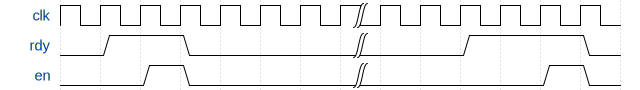
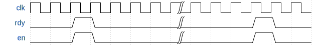
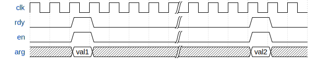
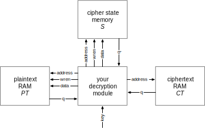

# ARC4 Decryption Circuit

[ARC4](https://en.wikipedia.org/wiki/RC4) is a symmetric stream cipher, and was once widely used in encrypting web traffic, wireless data, and so on; it has since been broken. Still, the structure of ARC4 is similar to modern symmetric encryption methods, and provides a good vehicle for studying digital circuits that make extensive use of on-chip memory.

### ARC4 Decryption

A stream cipher like ARC4 uses the provided encryption key to generate a pseudo-random byte stream that is xor'd with the plaintext to obtain the ciphertext. Because xor is symmetric, encryption and decryption are exactly the same.

The basic ARC4 algorithm uses the following parameters:

| Parameter | Type | Semantics |
| --- | --- | --- |
| `key[]` | input | array of bytes that represent the secret key (24 bits in our implementation) |
| `ciphertext[]` | input | array of bytes that represent the encrypted message |
| `plaintext[]` | output | array of bytes that represent the decrypted result (same length as ciphertext) |

and proceeds as shown in this pseudocode:

    -- key-scheduling algorithm: initialize the s array
    for i = 0 to 255:
        s[i] = i
    j = 0
    for i = 0 to 255:
        j = (j + s[i] + key[i mod keylength]) mod 256  -- for us, keylength is 3
        swap values of s[i] and s[j]

    -- pseudo-random generation algorithm: generate byte stream (“pad”) to be xor'd with the ciphertext
    i = 0, j = 0
    for k = 0 to message_length-1:
        i = (i+1) mod 256
        j = (j+s[i]) mod 256
        swap values of s[i] and s[j]
        pad[k] = s[(s[i]+s[j]) mod 256]

    -- ciphertext xor pad --> plaintext
    for k = 0 to message_length-1:
        plaintext[k] = pad[k] xor ciphertext[k]  -- xor each byte

The length of the secret key that we will use is 24 bits (3 bytes) to ensure that we can “crack” the encryption in a reasonable amount of time.

### The ready-enable microprotocol

The handshake has two sides: the “caller” and the “callee.” Whenever the callee is ready to accept a request, it asserts its `rdy` signal. If `rdy` is asserted, the caller may assert `en` to make a “request” to the callee. The following timing diagram illustrates this:

It is illegal for the caller to assert `en` if `rdy` is deasserted; if this happens, the behaviour of the callee is undefined.

Whenever `rdy` is asserted, it means that the callee is able to accept a request _in the same cycle_. This implies that a module that needs multiple cycles to process a request and cannot buffer more incoming requests **must** ensure `rdy` is deasserted in the cycle following the `en` call. Similarly, each cycle during which the `en` signal is asserted indicates a distinct request, so the caller must ensure `en` is deasserted in the following cycle if it only wishes to make a single request. The following timing diagram shows an example of this behaviour:

This microprotocol allows the callee to accept multiple requests and buffer them.

Finally, some requests come with arguments. For example, Task 3 requires you to write a decrypt module which follows the ready/enable microprotocol and takes the secret key as an argument. In this case, the argument port must be valid **at the same time** as the corresponding `en` signal, as in this diagram:

### ARC4 state initialization

The `src` folder you will find a `init5.sv` will implement the first step of ARC4, where the cipher state S is initialized to [0..255]:

    for i = 0 to 255:
        s[i] = i

The `init` module follows the ready/enable microprotocol.

### The Key-Scheduling Algorithm

Many symmetric ciphers, including ARC4, have a phase called the _Key-Scheduling Algorithm_ (KSA). The objective of the KSA is to spread the key entropy evenly across _S_ to prevent statistical correlations in the generated ciphertext that could be used to break the cipher. ARC4 does this by swapping values of _S_ at various indices:

    j = 0
    for i = 0 to 255:
        j = (j + s[i] + key[i mod keylength]) mod 256   -- for us, keylength is 3
        swap values of s[i] and s[j]

In folder `src` you will find `ksa4.sv`, which implements the KSA phase. Like `init`, the `ksa` module will implement the ready/enable microprotocol.

### The Pseudo-Random Generation Algorithm

The final phase of ARC4 generates the bytestream that is then xor'd with the input plaintext to encrypt the message, or, as in our case, with the input ciphertext to decrypt it. We don't need the bytestream by itself, so in this task we will combine both.

    i = 0, j = 0
    for k = 0 to message_length-1:
        i = (i+1) mod 256
        j = (j+s[i]) mod 256
        swap values of s[i] and s[j]
        pad[k] = s[(s[i]+s[j]) mod 256]

    for k = 0 to message_length-1:
        plaintext[k] = pad[k] xor ciphertext[k]  -- xor each byte

With Quartus, we will first generate two additional memories: one to hold the ciphertext (instance name _CT_), and another where you will write the plaintext (instance name _PT_). Both will be 8-bit wide and 256 8-bit words deep, and will connect to your ARC4 decryption module:

Both the plaintext and ciphertext are stored starting at address 0 as length-prefixed strings (described earlier).

In folder `src` you will find `prga3.sv`, which implements the PRGA phase. The `prga` module will also follow the ready/enable microprotocol.

We complete the ARC4 algorithm with the `arc4_3.sv` file. This should instantiate the _S_ memory and the three submodules, and activate everything in the right order to decrypt the ciphertext in the _CT_ memory (a length-prefixed string starting at address 0) and write the plaintext to _PT_ (which should also be a length-prefixed string at address 0). The `arc4` module also obeys rdy/en, and makes no assumptions about the key.

### Cracking ARC4

Now to decrypt some encrypted messages _without_ knowing the key ahead of time we will implement a `crack` module.

The messages that we are looking for are human-readable. An encrypted message is deemed to be cracked if its characters consist entirely of byte values between 'h20 and 'h7E inclusive (i.e., readable ASCII).

The `crack` module is very much like `arc4`, but both _S_ and _PT_ are now internal, _key_ is now an output, and the new _key_valid_ output indicates that _key_ may be read. On `en`, this module should sequentially search through the key space starting from key 'h000000 and incrementing by 1 every iteration. Once the computation is complete, it should assert `rdy` and, only if it found a valid decryption key, also set `key_valid` to 1 and `key` to the discovered secret key. If `key_valid` is 1, the `pt` memory inside `crack` should contain the corresponding plaintext in length-prefixed format.

You can find this module in the `crack.sv` module in the `src` folder. 

### Cracking in parallel

To speed up cracking, we will now run two `crack` modules at the same time: the first will start the search at 0 and increment by 2, and the second will start at 1 and also increment by 2. This is implemented in the in `doublecrack` module. The `doublecrack` module instantiates two `crack` modules.